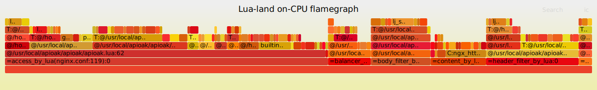

### 为什么要选择APIOAK？

* APIOAK 提供API发布、管理、运维的全生命周期管理。辅助用户简单、快速、低成本、低风险的实现微服务聚合、前后端分离、系统集成，向合作伙伴、开发者开放功能和数据。

* APIOAK 提供了几乎可以媲美原生 Nginx 的强劲性能，通过插件机制提供动态身份认证、流量控制等功能，并支持根据特定业务场景的自定义插件。同时还提供了多种动态负载均衡策略和功能。

* APIOAK 致力于打造一个简单易用，上手入门门槛低的网关。简单到让纯小白用户也可以用的上网关，用的明白网关。所谓的简单易用就是：「最大程度节省使用者时间，界面简单明了，操作方便，对于想要使用的功能一目了然」。这也就是APIOAK设计的初衷（第一句就提到了）。所以 操作性上经过 反复反复又反复 的采访众多程序猿（使用习惯），产品狗（用户使用体验），了解用户的使用习惯和操作惯性来确定出了一套适合大部分人的操作界面。

* APIOAK 极简配置，极速开始，无论是在使用还是在性能方面还是功能方面都做出了比较优秀的成绩（这里简单列出性能，使用教程看目录）。

---
#### 测试性能数据如下：

> 1.使用Google Cloud N1系列基础版（1 vCPU + 3.75 GB RAM）服务器进行测试。<br/>
> 2.使用2个线程运行基准测试20秒，保持200个HTTP连接打开。<br/>
> 平均响应时间（RTT）和每秒响应次数（QPS）成绩如下：
> ```bash
> Thread Stats   Avg      Stdev     Max   +/- Stdev
> Latency       2.65s   584.41ms   3.66s    57.25%
> Requests/sec:  24012.38
> ```
> 请求响应时间分布:
> ```bash
>  50.000%    2.63s 
>  75.000%    3.18s 
>  90.000%    3.44s 
>  99.000%    3.60s 
>  99.900%    3.64s 
>  99.990%    3.65s 
>  99.999%    3.66s 
> 100.000%    3.66s
> ```
> ---
> 压测火焰图：
> 

