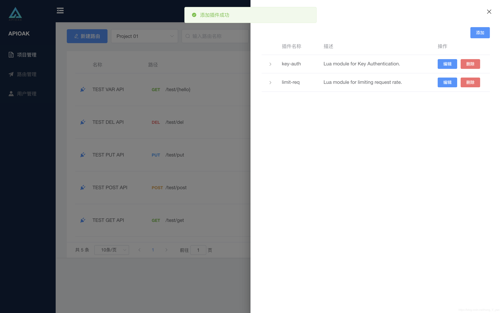

### 插件列表

插件列表入口在「项目列表」/「路由列表」名称前的 *插头* 标志。

「插件列表」的展示，主要是插件基本信息 「插件名称」/「插件描述」/「插件操作」。 
这里注意：有个小细节：

> 插件名称左侧的“尖括号”，点击可以展示当前插件的配置信息。 
> &nbsp;&nbsp;&nbsp;&nbsp;&nbsp;&nbsp;（如果查看插件配置信息需要点进插件内部，那得看多麻烦，在这里看一目了然） 
> 插件的编辑点击进去直接命中为可填写的插件配置信息，无需再次TAb切换了。
>

界面如下：

