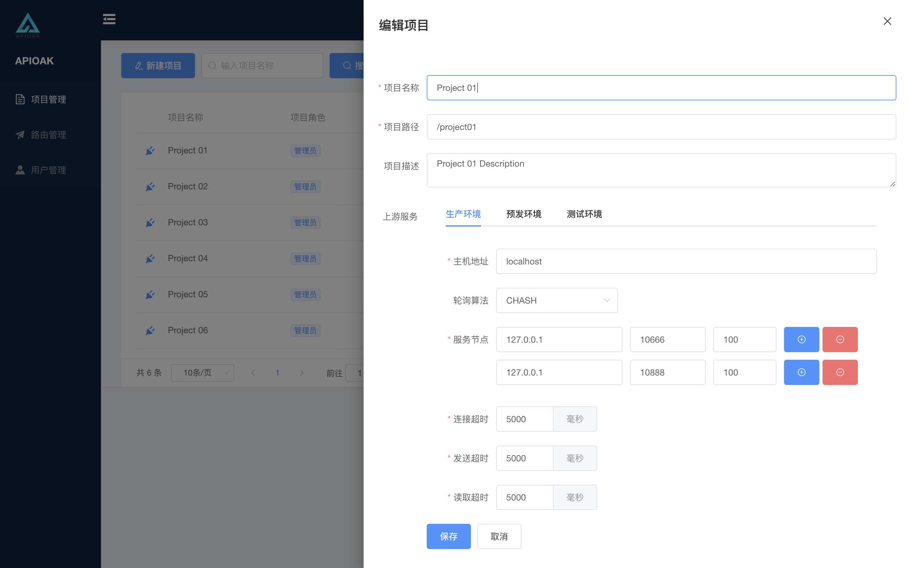

### 项目 新建/编辑

项目的新增和项目的编辑基本可以理解为一个功能。 
新建就是在没有项目的基础上进行增加项目，填写新的项目的基本数据。 
编辑就是在已有的项目基础上进行修改项目的基本数据。 

- 项目名称：项目的标识，针对项目的意思的描述。

- 项目路径：这里是前端请求的路径组合部分之一，请求时该路径会在 「路由路径」（「路由路径」将在 「路由 新建/编辑」中的 「[前端配置](../route-manage/router-fore-end.md)」 中提到）之前。 

- 项目描述：项目的描述，可以仔细描述项目的作用和项目存在的意义等。

- 上游服务：即项目所搭建的服务配置，这里支持多环境，多节点。
> 项目支持 多环境 配置，多环境分为了，「测试环境」/「预发环境」/「生产环境」，可以在不同环境间进行切换，各环境相互独立。各环境中支持 多节点 配置，多节点配置的算法支持 「CHASH」和 「ROUNDROBIN」（算法支持后续还会继续完善）。 
同时有超时限时配置，让响应数据变的更智能。
> 注意：服务结点的配置可以支持端口和权重的配置，多节点自由搭配，让你的服务搭配的更 得心应手，随心所欲，为所欲为 （自由三联-红绿灯）。

界面如下：

