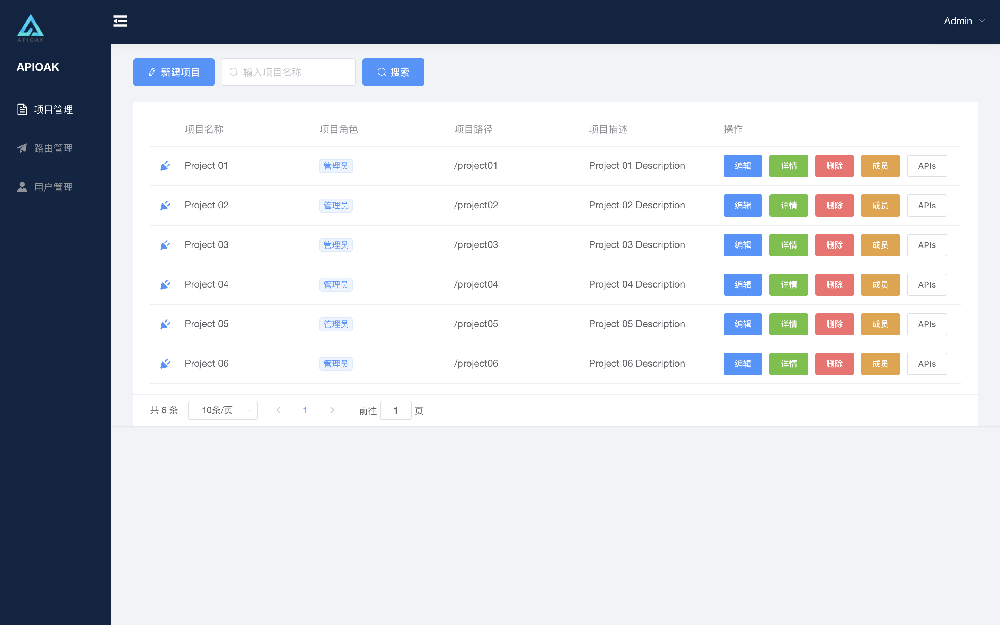

### 项目列表

项目列表中展示简单的项目信息，提取出项目中最重要的信息来展示，「项目名称」/「当前用户在该项目中的角色」/「项目路径」/「项目描述」/「项目操作按钮」。<br/>

<font size=4 color="red">注意</font>： 「项目名称」前面的 <font size=4 color="red">*「插头」*</font> 标志了没？那是项目的 <font size=4>*插件！插件！插件！*</font> (不行了，不行了，我脑袋里有画面。。。<font size=4>**😉😜😉😜😉😜😂😂😂**</font>。。。我怀疑你们在这里聚众飙车，所有看到这里的都拘了，包括我！<font size=4>**😰😰😰**</font>) 别着急，别着急，后面会在 [插件管理](../plugin-manage/plugin-introduction.md) 中单独说明。<br/>

 我们的原则就是：<font size=4>**非必要则不展示的原则**</font>。   <font size=5>**豪横** *!*</font>  <font size=4>**😎😎😎**</font>。

界面如下：



```
[插件]解释：是一种遵循一定规范的应用程序接口编写出来的程序。很多软件都有插件，插件有无数种。
这里APIOAK的插件就是有验证类插件（验证权限），控制类插件（控制流量），让系统功能更加的丰富，笼统的来讲，就是按照一定规范开发的外接功能包（后期会支持自定义插件配置）。
```


