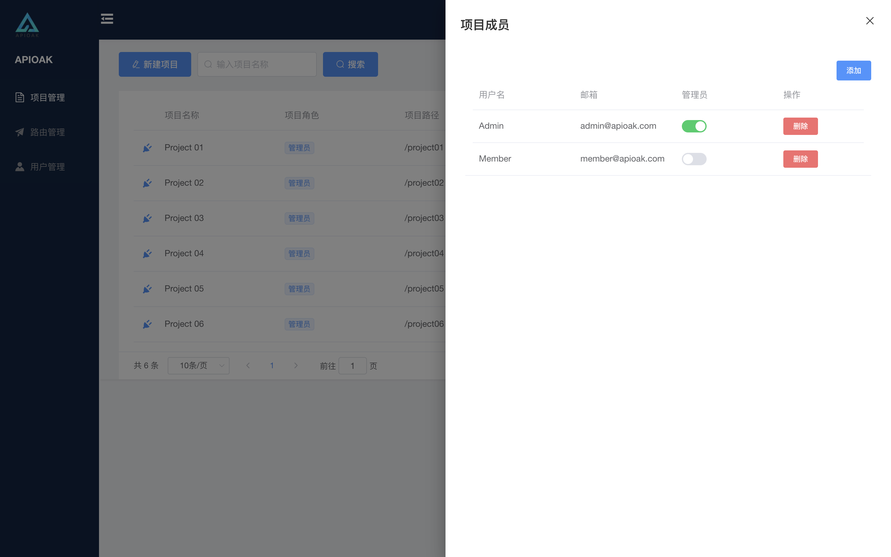
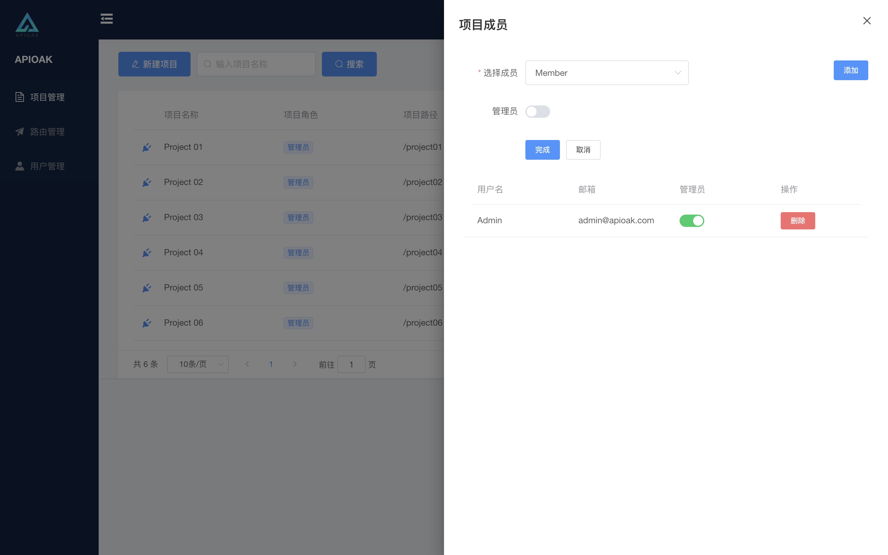

### 项目成员

---
#### 项目成员列表

这里先说下项目成员的作用，「项目成员」就是要给该项目设置可以查看的用户，并且设置用户时也可以选择性让项目成员成为项目管理员，项目管理员可以针对项目进行编辑，非管理员则只有查看权限。<br/>

界面如下：


---
#### 项目成员增加

- 增加方式为下拉式选择成员，选择对象为 除超级管理员和本项目成员 以外的用户。
- 增加项目成员的同时可以设置是否开启新成员项目管理员权限，多项目管理员为平行管理设计，我叫其为「多租户」。
- 增加完成后会以 列表 形式展示在当前页面的下方，列表中也可以指定用户是否为管理员，也可直接删除项目成员，项目管理员可以互相管理。

<font color="red">注意：</font>超级管理员可以增加全部项目的管理员和成员，项目管理员可以增加当前项目中的管理员和成员。

界面如下：



```
[多租户]解释：相当于是可以同级是可以相互管理的，或者是互踢。
 这样设计的原因：比如A在公司时管理员A离职了B接手 A把B设置为管理员后 A离职后B可以把A在项目中题掉。
```


