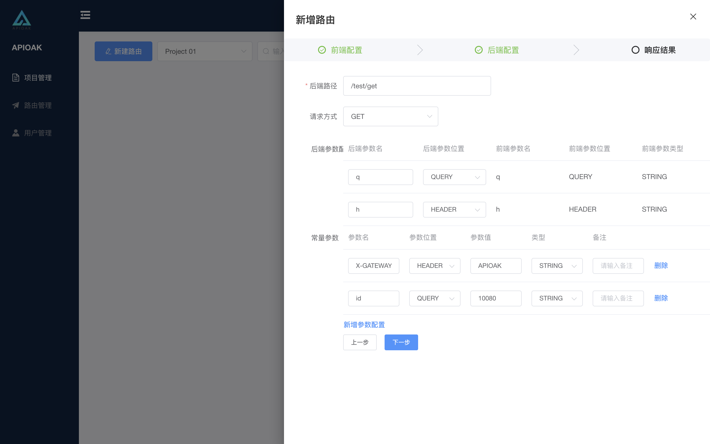

### 后端配置

后端配置主要是网关内转发到上游服务时使用的地址和参数配置为主。

#### 参数配置详情：

1. 后端路径：转发上游服务的 <font color=EB0011>全路径</font> 地址。
```angular2
全路径是指：这里的全路径就是URL中摘除域名以后的字符串（也可叫路径），这就是全路径，例如：www.xxxxx.com/api/v1/test ，这里 /api/v1/test 即为咱们文章里所说的全路径。 ↩︎
```

2. 请求方式：转发上游服务时的请求方式，目前支持：GET / POST / PUT / DELETE。

3. 后端参数配置：将前端请求的参数转发到上游服务参数时的配置。（<font color=EB0011>注意：</font>参数支持多个，<font color=01d0c5>同时支持前后端参数的交叉映射</font>）。
> ❶后端参数名：转发上游服务时使用的参数名称。<br/>
> ❷后端参数位置：转发上游服务时参数所在的位置，目前支持：Header / Path / Query。<br/>
> ❸前端参数名：前端请求时使用的参数名称。这里主要是与后端参数做对应关系（该字段<font color=EB0011>仅做展示</font>）。<br/>
> ❹前端参数位置：前端请求时使用的参数所在的位置。这里主要是与后端参数做对应关系（该字段<font color=EB0011>仅做展示</font>）。<br/>
> ❺前端参数类型：前端请求时使用的参数类型。这里主要是与后端参数做对应关系（该字段<font color=EB0011>仅做展示</font>）。

4. 常量参数：看到 常量 很容易想到，固定不变的值，没错，这里是固定不变的参数值，转发上游服务时固定不变的参数。（<font color=EB0011>注意：</font>常量参数支持多个，多个常量参数支持不同位置）。
> ❶参数名：常量参数的名称。<br/>
> ❷参数位置：量参数的位置，目前支持：Header / Path / Query。<br/>
> ❸参数值：常量参数的参数值。<br/>
> ❹类型：常量参数的参数值的类型，目前支持：STRING / INTEGER / BOOLEAN / FLOAT。<br/>
> ❺备注：常量参数的简单描述。

界面如下：



