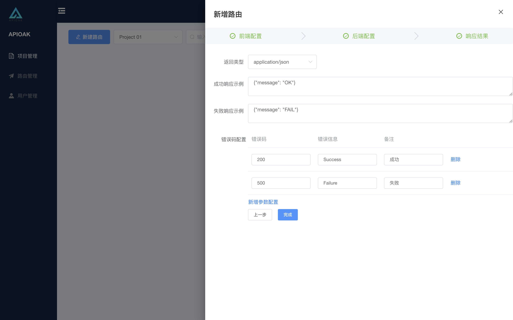

### 响应结果配置

响应结果主要是为前端返回的结果数据，为什么要单独说这一块呢，应了那句话：既然存在，肯定不是有道理的。下面重点来了。

#### 参数配置详情：

<font color="red" size=4>咳咳~，敲黑板啦！👽👽👽重点不断，快记一下哈：</font>

1. 支持自定义返回数据的类型，目前支持：application/json 、 text/html 、 text/xml。

2. 成功响应实例：请求成功后的响应 <font color="red" size=4>Mock数据</font>，Mock数据要与 「路由 发布/下线/复制」中的 「[路由发布](route-operation.md)」 配合使用。
```Mock
Mock数据：
模拟后端返回的结果数据。
这里自己组合一段后端返回的指定数据结构的结果数据，增加到响应默认值上即可，接口未发布的情况下都回返回这里的模拟数据。
```

3. 失败响应实例：同请求成功后的响应一样，支持<font color="red" size=4>Mock数据</font>。

4. 错误码配置：可以清晰看到接口中的错误信息，响应数据状态码，将接口响应数据前置。

<font color="red" size=4>注意啦，Mock数据的重点来喽！</font> <br/>
<font size=3 color=#01d0c5 > 
接口发布前所有前端请求的数据返回结果都是Mock数据，接口发布后会使用发布环境的真实数据。<br/>
&nbsp;&nbsp;&nbsp; 理由：<font size=5 color=#EB0011>前后端并行开发</font> 提前规定好接口数据的格式，接口录入到网关内，写入Mock数据，<br/>
&nbsp;&nbsp;&nbsp; 前端正常调用接口数据开发功能，同时后端按照Mock数据格式正常开发接口。
</font>


界面如下：




