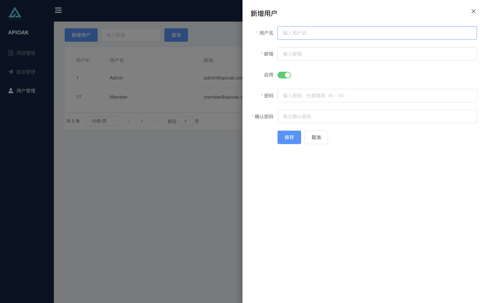
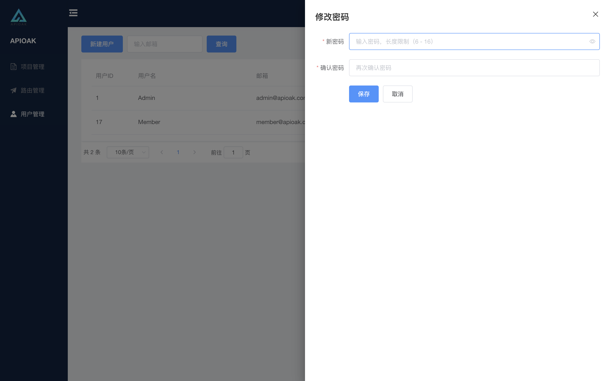

### 用户 新增/编辑

#### 用户新增

跟用户注册一样，只是多了是否将新建用户启用的选项，毕竟是系统超级管理员操作（给点面子，可以禁用删除用户的那种  **😏😏😏**），目前只有超级管理员可以新增用户并查看所有用户列表 其余所有人都只能看到自己包括项目管理员。

界面如下：

---

#### 用户编辑

这里的用户编辑跟 「项目编辑」/「路由编辑」 不一样了，这里的编辑是将用户的密码重新设置，就是：更改密码。

界面如下：

