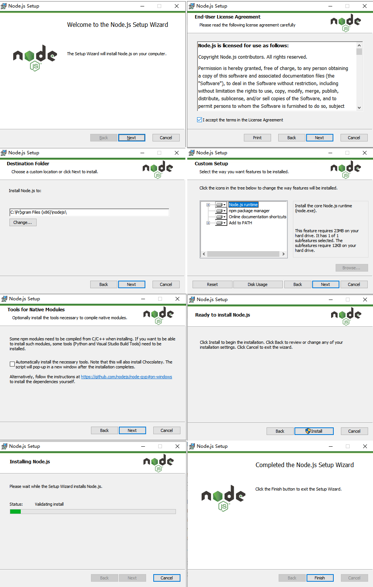
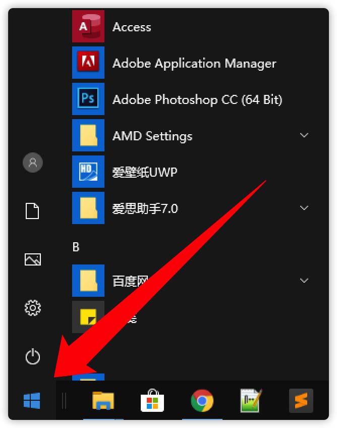

### Gitbook local build tutorial

#### Windows 

1.Install Nodejs

You can download the LTS stable version of Windows Installer from the [Nodejs](https://nodejs.org/en/download/) official website to install it.


The installation is very simple, just click Next to install. When you encounter the Install button, click Install to install. The rest is to wait for the installation to complete.<br/>

Installation tutorial:


After the installation is complete, click the Windows window logo at the bottom left corner of the computer screen:


Click ```CMD``` directly on the keyboard:


Open the command line and enter the following command to verify that Nodejs is installed successfully.
```
node -v
```   

As shown in the figure above, it means that the installation is successful and you can proceed to the next step.

2.Install Gitbook

Open the command line and enter the following command, enter the following command line.

```
npm install gitbook -g
npm install gitbook-cli -g
```

Use the following command to check whether the installation is successful. If the version number appears, the installation is successful.
```
gitbook -V
```

3.Initialize the project

Select the directory, use the following command to create your own gitbook folder, and initialize the project.
```
mkdir direName //Create folder directory
cd direName    //Enter the folder directory
gitbook init   //Initialize the project
```

4.Launch document

Download the compressed project file and unzip it. Go to the folder where the document was unzipped and execute the following command.

```
gitbook serve
```

5.Read the tutorial documentation

The local browser can visit `` `http: //127.0.0.1: 4000``` to officially access the current tutorial document.

---

#### Mac OS X 

1.Install Nodejs

- You can download the LTS stable version of macOs Installer from the [Nodejs](https://nodejs.org/en/download/) official website to install it.

- Install using terminal command line

  > - Click the "Launchpad" icon in the dock , Type "terminal" in the search bar and click "terminal".
  > - In "Visit"  , Open "/ Applications / Utilities" and double-click "Terminal".
  > - Enter the command line in the terminal to install:  ```brew install node```

Open the command line and enter the following command to verify that Nodejs is installed successfully.
```
node -v
```

2. Install Gitbook

Open the command line and enter the following command, enter the following command line.

```gitbook
sudo npm install gitbook -g
sudo npm install -g gitbook-cli
```

Use the following command to check whether the installation is successful. If the version number appears, the installation is successful.

```
gitbook -V
```

3.Initialize the project

Select the directory, use the following command to create your own gitbook folder, and initialize the project.
```
mkdir direName //Create folder directory
cd direName    //Enter the folder directory
gitbook init   //Initialize the project
```

4.Launch document

Download the compressed project file and unzip it. Go to the folder where the document was unzipped and execute the following command.

```
gitbook serve
```

5.Read the tutorial documentation

The local browser can visit `` `http: //127.0.0.1: 4000``` to officially access the current tutorial document.

