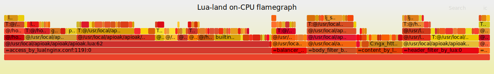

### Why APIOAK?

* APIOAK provides full lifecycle management of API release, management, and operation and maintenance. Assist users in simple, fast, low-cost, and low-risk implementation of microservice aggregation, front-end and back-end separation, system integration, and open functions and data to partners and developers.

* APIOAK provides powerful performance almost comparable to native Nginx, provides dynamic identity authentication, flow control and other functions through the plug-in mechanism, and supports custom plug-ins based on specific business scenarios. It also provides a variety of dynamic load balancing strategies and functions.

* APIOAK is an easy-to-use, easy-to-use gateway. It's so simple that junior programmer users can also use the gateway and understand the gateway. It is easy to use: "It saves the user's time to the greatest extent, the interface is simple and clear, the operation is convenient, and the functions you want to use are clear at a glance." This is the original intention of APIOAK design (mentioned in the first sentence). Therefore, the operability has repeatedly interviewed many programmers (usage habits) and products (user experience) to understand the user's usage habits and operation inertia to determine a set of operation interface suitable for most people.

* APIOAK's minimalist configuration starts quickly, and it has made excellent results in terms of use, performance, and functionality.

---
#### Pressure test performance data are as follows:

> 1.Use Google Cloud N1 series basic version (1 vCPU + 3.75 GB RAM) server.<br/>
> 2.Use 2 threads to run the benchmark for 20 seconds, keeping 200 HTTP connections.<br/>
> The average response time (RTT) and response times per second (QPS):
> ```bash
> Thread Stats   Avg      Stdev     Max   +/- Stdev
> Latency       2.65s   584.41ms   3.66s    57.25%
> Requests/sec:  24012.38
> ```
> Request response time distribution:
> ```bash
>  50.000%    2.63s 
>  75.000%    3.18s 
>  90.000%    3.44s 
>  99.000%    3.60s 
>  99.900%    3.64s 
>  99.990%    3.65s 
>  99.999%    3.66s 
> 100.000%    3.66s
> ```
> ---
> Flame chart:
> 

