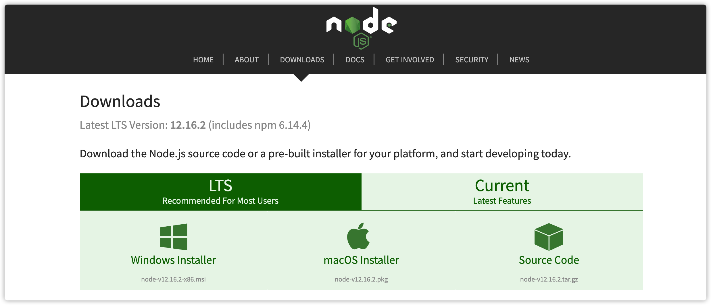
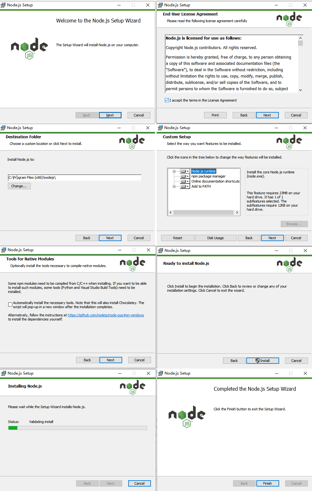
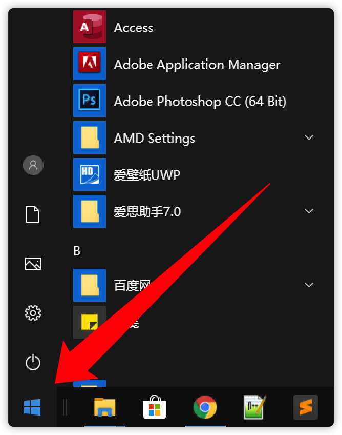
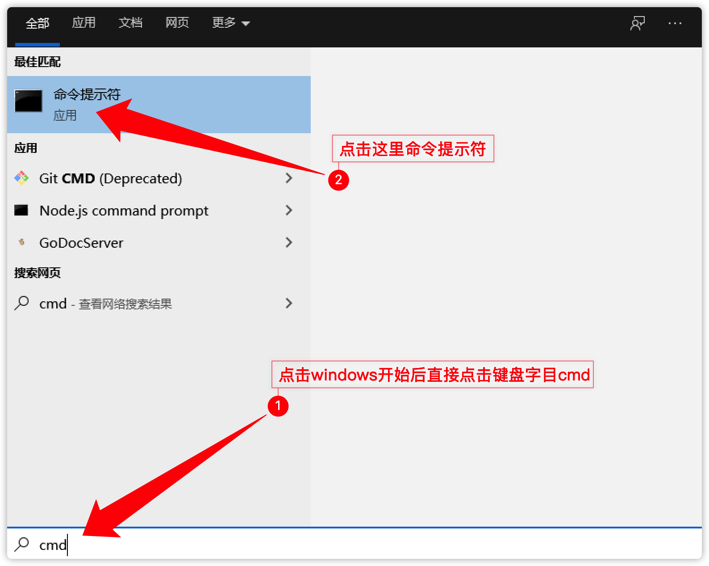
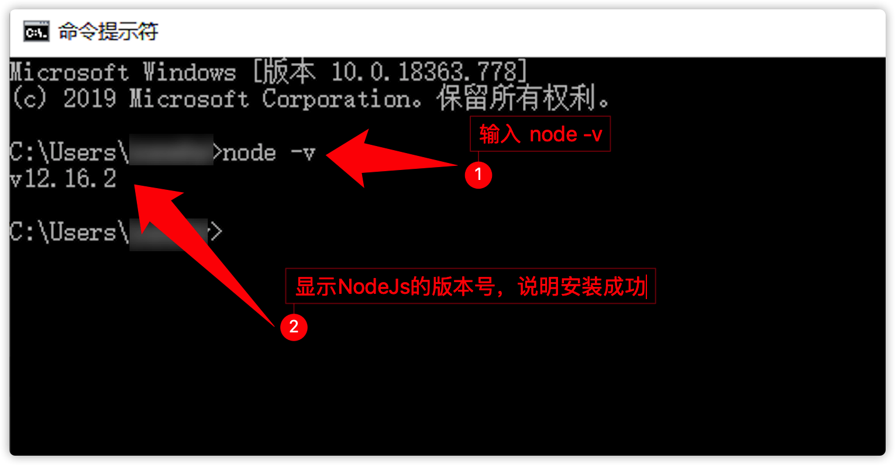

### gitbook 本地搭建

#### 在 Windows 上环境

1.安装Nodejs

安装Nodejs，可以到 [Node官网](https://nodejs.org/en/download/) 点击 LTS 稳定版的 Windows Installer 进行下载，下载后进行双击打开安装。<br/>



安装很简单，一路火花带闪电点击 Next 进行下一步安装即可，碰到带有 Install 按钮的时候点击 Install 进行安装，剩下就是等待安装完成了。<br/>
安装教程图：


安装完成后，打开命令行：
点击电脑屏幕最左下角的 Windows 窗口(户) 标志，如图：


点击后直接在键盘点击 ```cmd```，如图：


打开命令行以后输入以下命令，验证Node是否安装完成
```
node -v
```   

如上图中展示，则说明安装成功，可以进行下一步操作。

2.安装gitbook（这里都是在命令行中完成）
在Nodejs安装目录下打开命令控制台，输入以下命令行
```
npm install gitbook -g
npm install gitbook-cli -g
```

安装完成后使用以下命令查看是否安装成功，如果出现版本号，则说明安装成功。
```
gitbook -V
```

3.初始化自己的项目

在命令行模式下，选择自己的目录，使用以下命令来创建自己的gitbook文件夹，并初始化项目。
```
mkdir direName //创建自己的文件夹目录
cd direName    //进入到自己的gitbook文件夹目录
gitbook init   //初始化gitbook项目
```

4.启动文档

下载当前gitbook项目文档压缩文件，并解压出来。进入到文档解压的文件夹内，执行以下命令。
```
gitbook serve
```

5.阅读文档

本地浏览器访问 ```http://127.0.0.1:4000``` 即可正式访问当前教程文档。 

---

#### 在 Mac OS X 上搭建环境

1. 安装Nodejs

- 可以到 [Node官网](https://nodejs.org/en/download/) 下载 LTS 稳定版的 macOs Installer 进行安装（图片见Windows安装教程中的Node官网）。
安装完成后在命令行以下命令来检测是否安装成功。

- 使用终端命令行进行安装
  > - 点按程序坞中的“启动台”图标 ，在搜索栏中键入“终端”，然后点按“终端”。
  > - 在“访达”  中，打开“/应用程序/实用工具”文件夹，然后连按“终端”。
  > - 在终端中输入一下命令行来进行安装 : ```brew install node```

安装完成后在命令行内输入以下命令来检测是否安装成功。
```
node -v
```

2. 安装gitbook

同样进行打开终端（打开终端的方式在安装Node时提及了），进入到自己的想要安装的目录中，输入以下命令行进行安装 gitbook

```gitbook
sudo npm install gitbook -g
sudo npm install -g gitbook-cli
```

安装完成后使用以下命令查看是否安装成功
```
gitbook -V
```

3.初始化自己的项目

在命令行模式下，选择自己的目录，使用以下命令来创建自己的gitbook文件夹，并初始化项目。
```
mkdir direName //创建自己的文件夹目录
cd direName    //进入到自己的gitbook文件夹目录
gitbook init   //初始化gitbook项目
```

4.启动文档

下载当前gitbook项目文档压缩文件，并解压出来。进入到文档解压的文件夹内，执行以下命令。
```
gitbook serve
```

5.阅读文档

本地浏览器访问 ```http://127.0.0.1:4000``` 即可正式访问当前教程文档。 


