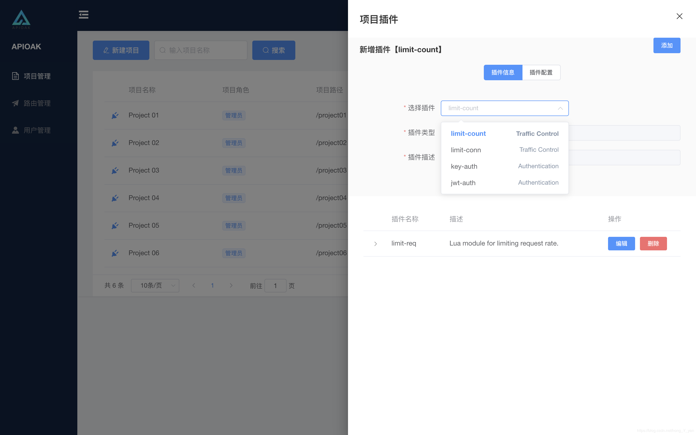

### 插件 新建/编辑

因为项目插件和路由插件的配置规则一样，这里放在一起说明。

---

#### 插件增加

插件的增加入口在「插件列表」的右上角「添加」按钮（插件列表入口在「项目列表」/「路由列表」名称前的*插头* 标志）。 
插件增加时默认展示为插件的基本信息，选择插件（以列表下拉形式选择要增加的插件），插件类型（不可更改），插件描述（不可更改）。TAB切换到「插件配置」可以自定义当前选择插件的参数。增加插件完成后会以 列表 形式展示在当前页面。 
细节，细节来了哦~： 

> 1. 选择插件时不仅展示插件的名称，还会展示插件的类型 「认证类」 /「 限制类」 方便快速的选择需要类型的插件。 
> 2. 同一个项目或者同一个路由的插件 不会重复，插件列表只会展示当前 项目 或者 路由 没有增加的插件。 
> 3. 插件的增加完全不影响插件列表的展示，会在插件列表上放展示插件增加的信息。
>

界面如下：

