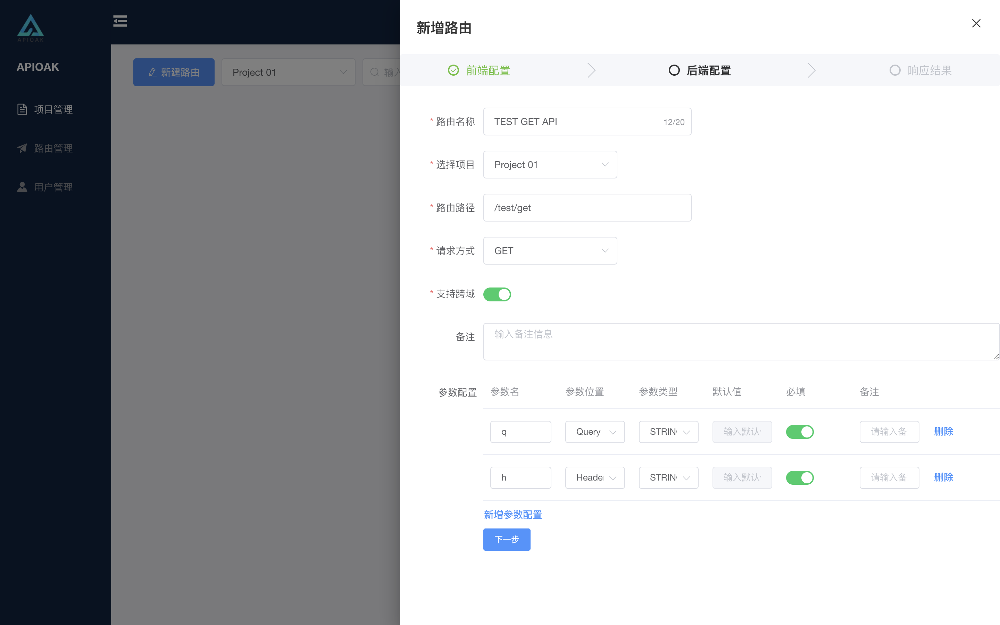

### 前端配置

前端配置主要以用户访问的地址和参数配置为主，其余为路由的基本属性配置信息。

#### 参数配置详情：

1. 路由名称：基本属性中的路由名称，展示在路由列表中的名称一栏。

2. 路由路径：这里是前端请求的路径组合部分之一，放在项目路径（「项目路径」在 「项目管理」的 「[项目 新建/编辑](../project-manage/project-edit.md) 」中提到过）之后。
> 咳咳~，开始敲黑板了哈！👽👽👽重点来啦，快记一下哈： 
>  ❶ **路由路径 支持 {} 内输入变量，路径上设置了变量 必须在下面的参数配置中定义。 
> &nbsp;&nbsp;&nbsp; 例如：/apioak/{id}，参数id则必须在参数配置中增加 。  
> ❷ 同时路径格式 必须以 "/" 开头，支持大小写字母、数字 和 - _ . 等符号**。

3. 请求方式：前端请求接口时的请求方式，目前支持：GET / POST / PUT / DELETE。

4. 支持跨域：在请求接口时，是否支持接口请求的跨域。

5. 路由备注：针对当前路由的简单说明。

6. 参数配置：前端请求接口时需要传递的参数配置。（注意：参数支持多个，多个参数支持不同位置）。
>❶参数名称：请求时使用的参数名称。 
>❷参数位置：请求时参数所在的位置，目前支持：Header / Path / Query。 
>❸参数类型：请求时参数的类型，目前支持：STRING / INTEGER / BOOLEAN / FLOAT。 
>❹参数必填选项：请求时该参数是否为必填参数，开启为必填，关闭为选填。 
>❺参数默认值：请求时参数的值。 开启必填时，该值不允许设置默认值。关闭必填时，可以设置参数默认值。 
> 注意：**如果参数设置了为必填，但是在前端请求时没有传递该参数，网关会直接拦截 把请求打回去** 
>❻参数备注：针对当前参数的简单说明。

界面如下：

